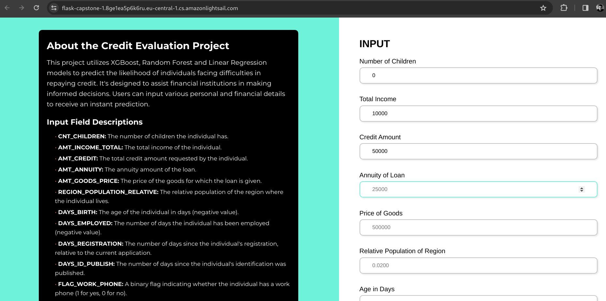
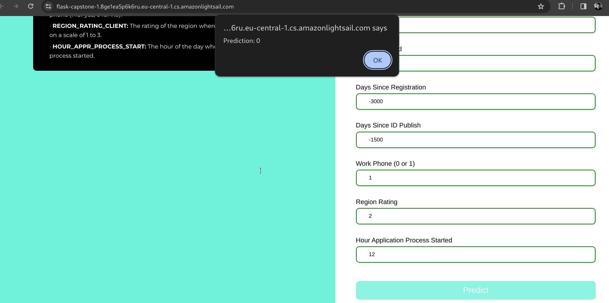

# ML Zoomcamp Capstone 1 project: Bank Credit Evaluation

> Link for testing: [https://flask-capstone-1.8ge1ea5p6k6ru.eu-central-1.cs.amazonlightsail.com/](https://flask-capstone-1.8ge1ea5p6k6ru.eu-central-1.cs.amazonlightsail.com/)

## Contents

- [Overview](#overview)
- [Problem Statement](#problem-statement)
- [Application](#application)
- [Installation](#installation)
  - [Prerequisites](#prerequisites)
  - [Setting Up the Project](#setting-up-the-project)
  - [Running the Application in Virtual Environment](#running-the-application-locally)
  - [Docker](#docker)
  - [Deploying to cloud using AWS Lightsail](#deploying-to-cloud-using-aws-lightsail)
- [Usage](#usage)
  - [Accessing the Web Interface](#accessing-the-web-interface)
  - [Using REST API Endpoints](#using-rest-api-endpoints)
- [Exploratory Data Analysis (EDA)](#exploratory-data-analysis-eda)
- [ML Models Used in This Project](#ml-models-used-in-this-project)
  - [Logistic Regression](#logistic-regression)
  - [Random Forest Classifier](#random-forest-classifier)
  - [XGBoost](#xgboost)

## Overview

This project focuses on predicting individuals' credit repayment difficulties using machine learning techniques. It leverages a comprehensive dataset from [Kaggle's Credit Evaluation Dataset](https://www.kaggle.com/datasets/heinereugene/credit-evaluation), which includes various features related to individuals' financial and personal backgrounds. The primary goal is to build a predictive model that can accurately determine whether an individual will have difficulty repaying credit.

## Problem Statement

The challenge addressed in this project is to analyze and predict credit repayment difficulties based on a range of features including income, loan amount, age, employment history, and other personal attributes. The dataset provides a binary target variable, 'TARGET', indicating whether an individual had difficulty in repaying the credit (1 for difficulty, 0 for no difficulty).

For [detailed data exploration](EDA.ipynb) and [modeling](train.ipynb), the following key features are used:

- 'CNT_CHILDREN': Number of children the individual has.
- 'AMT_INCOME_TOTAL': Total income of the individual.
- 'AMT_CREDIT': Credit amount requested.
- 'AMT_ANNUITY': Annuity of the loan.
- 'AMT_GOODS_PRICE': Price of the goods for which the loan is given.
- 'REGION_POPULATION_RELATIVE': Relative population of the region.
- 'DAYS_BIRTH': Age of the individual in days (negative value).
- 'DAYS_EMPLOYED': Number of days the individual has been employed (negative value).
- 'DAYS_REGISTRATION': Number of days the individual's registration was made relative to the current application.
- 'DAYS_ID_PUBLISH': Number of days since the individual published their ID.
- 'FLAG_WORK_PHONE': Binary flag indicating if the individual has a work phone (1 for yes, 0 for no).
- 'REGION_RATING_CLIENT': Region rating of the client.
- 'HOUR_APPR_PROCESS_START': Hour of the day when the loan application process started.

The dataset can be accessed and downloaded directly from Kaggle:

```sh
kaggle datasets download -d heinereugene/credit-evaluation
unzip credit-evaluation.zip && mv .csv credit-evaluation.csv
```

The models built in this project, including **Logistic Regression**, **RandomForest**, and **XGBoost**, have been fine-tuned for optimal performance. They provide insights for financial institutions to make informed decisions regarding credit approvals, thereby reducing the risk of bad debts.

## Application

The models are deployed as REST API services, allowing for easy integration into credit evaluation systems. Financial institutions can use these models to assess the risk profile of loan applicants. To get a prediction, a request can be sent to the respective model's endpoint with the relevant data:

```sh
curl -X POST https://flask-capstone-1.8ge1ea5p6k6ru.eu-central-1.cs.amazonlightsail.com//predict/xgboost \
-H "Content-Type: application/json" \
-d '{
    "CNT_CHILDREN": 2,
    "AMT_INCOME_TOTAL": 50000,
    "AMT_CREDIT": 200000,
    "AMT_ANNUITY": 10000,
    "AMT_GOODS_PRICE": 180000,
    "REGION_POPULATION_RELATIVE": 0.01,
    "DAYS_BIRTH": -12000,
    "DAYS_EMPLOYED": -2000,
    "DAYS_REGISTRATION": -3000,
    "DAYS_ID_PUBLISH": -1500,
    "FLAG_WORK_PHONE": 1,
    "REGION_RATING_CLIENT": 2,
    "HOUR_APPR_PROCESS_START": 10
}'
```

The response will be in JSON format, indicating the model's prediction:

```json
{
  "prediction": 0
}
```

## Installation

### Prerequisites

- [Pipenv](https://pipenv.pypa.io/en/latest/#install-pipenv-today)
- [Docker](https://www.docker.com/products/docker-desktop)
- [AWS CLI](https://aws.amazon.com/cli/) (for AWS Lightsail deployment)

### Setting Up the Project

1.  Clone the Repository (skip if you have the project files):

        `git clone https://github.com/lumenalux/mlzoomcamp-2023-capstone-1.git

    cd mlzoomcamp-2023-capstone-1`

2.  Set Up the Python Environment using Pipenv:

    ```sh
    # Navigate to the project directory if you haven't already
    cd mlzoomcamp-2023-capstone-1

    # Install dependencies from Pipfile
    pipenv install
    ```

3.  Activate the Pipenv Shell (virtual environment):

    ```sh
    pipenv shell
    ```

### Running the Application Locally

1.  Start the Flask App:

    ```sh
    python predict.py
    ```

2.  Run Tests:

    ```sh
    python test.py
    ```

### Docker

1.  Build the Docker Image:

    ```sh
    docker build -t capstone1 .
    ```

2.  Run the Docker Container Locally (optional):

    ```sh
    docker run -p 5000:5000 capstone1
    ```

### Deploying to cloud using AWS Lightsail

Deploying the application to AWS Lightsail is straightforward using the AWS CLI. Before you begin, ensure you have the AWS CLI installed and configured with the necessary credentials.

1.  Build the Docker Image (if not already built):

    ```sh
    docker build -t <your-image-name> .
    ```

2.  Push the Docker Image to AWS Lightsail:

    - Use the following command to push your Docker image to your Lightsail container service:

      ```sh
      aws lightsail push-container-image --service-name <your-lightsail-service-name> --label <your-image-label> --image <your-image-name>
      ```

    - Replace `<your-lightsail-service-name>`, `<your-image-label>`, and `<your-image-name>` with your specific details.
    - This command uploads your local Docker image to the Lightsail container service and prepares it for deployment.

3.  Deploy the Image in Lightsail:

    - Log in to the AWS Lightsail console.
    - Navigate to the 'Containers' tab.
    - Locate your container service (`<your-lightsail-service-name>`) and update the deployment with the new image labeled `<your-image-label>`.
    - AWS Lightsail will then handle the deployment process. Once completed, your application will be live.

4.  Access the Application:

    - After deployment, your application can be accessed through the public domain provided by AWS Lightsail.

## Usage

### Accessing the Web Interface

For a user-friendly experience, access the application's web interface by navigating to the following link:

https://flask-capstone-1.8ge1ea5p6k6ru.eu-central-1.cs.amazonlightsail.com/

Here, you can interact with the model predictions through an intuitive UI:




### Using REST API Endpoints

The application provides several endpoints to make credit evaluation predictions using different machine learning models. You can send a POST request to these endpoints with the required data in JSON format.

#### Endpoints

- XGBoost Classifier:

  - URL: `https://flask-capstone-1.8ge1ea5p6k6ru.eu-central-1.cs.amazonlightsail.com/predict/xgboost`
  - Local URL: `http://localhost:5000/predict/xgboost`

- Random Forest Classifier:

  - URL: `https://flask-capstone-1.8ge1ea5p6k6ru.eu-central-1.cs.amazonlightsail.com/predict/random_forest`
  - Local URL: `http://localhost:5000/predict/random_forest`

- Logistic Regression Classifier:

  - URL: `https://flask-capstone-1.8ge1ea5p6k6ru.eu-central-1.cs.amazonlightsail.com/predict/logistic_regression`
  - Local URL: `http://localhost:5000/predict/logistic_regression`

#### Making a Prediction

To make a prediction, send a POST request to the desired endpoint with the required data. Here's an example using `curl`:

```sh
curl -X POST https://flask-capstone-1.8ge1ea5p6k6ru.eu-central-1.cs.amazonlightsail.com/predict/logistic_regression \
-H "Content-Type: application/json" \
-d '{
    "CNT_CHILDREN": 2,
    "AMT_INCOME_TOTAL": 50000,
    "AMT_CREDIT": 200000,
    "AMT_ANNUITY": 10000,
    "AMT_GOODS_PRICE": 180000,
    "REGION_POPULATION_RELATIVE": 0.01,
    "DAYS_BIRTH": -12000,
    "DAYS_EMPLOYED": -2000,
    "DAYS_REGISTRATION": -3000,
    "DAYS_ID_PUBLISH": -1500,
    "FLAG_WORK_PHONE": 1,
    "REGION_RATING_CLIENT": 2,
    "HOUR_APPR_PROCESS_START": 10
}'
```

## Exploratory Data Analysis (EDA)

An exploratory data analysis (EDA) for this project is provided in the [EDA.ipynb](EDA.ipynb) notebook. It contains visualizations and insights derived from the dataset.

## ML Models Used in This Project

### Logistic Regression

The [train.ipynb](train.ipynb) notebook explores the use of Logistic Regression for credit repayment difficulty prediction. This model assesses the probability of individuals facing issues in repaying credit based on various financial and personal features.

Endpoint:

`POST /predict/logistic_regression`

Performance:

```txt
              precision    recall  f1-score   support

         0.0       0.87      0.62      0.72      4986
         1.0       0.22      0.54      0.32      1014

    accuracy                           0.61      6000
   macro avg       0.55      0.58      0.52      6000
weighted avg       0.76      0.61      0.65      6000
```

### Random Forest Classifier

The Random Forest model is investigated in the [train.ipynb](train.ipynb) notebook for its effectiveness in predicting credit repayment difficulties. It utilizes an ensemble of decision trees to improve prediction accuracy and prevent overfitting.

Endpoint:

`POST /predict/random_forest`

Performance:

```txt
              precision    recall  f1-score   support

         0.0       0.84      0.97      0.90      4986
         1.0       0.34      0.07      0.11      1014

    accuracy                           0.82      6000
   macro avg       0.59      0.52      0.50      6000
weighted avg       0.75      0.82      0.77      6000
```

### XGBoost

XGBoost is featured in the [train.ipynb](train.ipynb)notebook for its high performance and speed. This gradient boosting framework is used to predict the likelihood of credit repayment difficulties, leveraging its robust handling of a variety of data types.

Endpoint:

`POST /predict/xgboost`

Performance:

```txt
              precision    recall  f1-score   support

         0.0       0.84      0.98      0.90      4986
         1.0       0.35      0.05      0.08      1014

    accuracy                           0.82      6000
   macro avg       0.59      0.51      0.49      6000
weighted avg       0.75      0.82      0.76      6000
```
